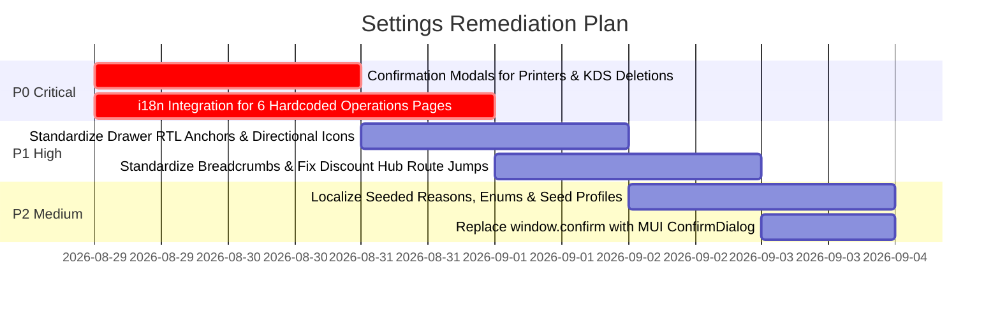

# 🔍 Information Architecture, Translation Readiness & Bug Audit Report: Settings Domain

**Audit Target URL:** `http://localhost:8081/app/settings`  
**Application:** Gnext Prototype v2  
**Date:** 2026-08-28  
**Audit Scope:** Full Information Architecture (IA), UX, Translation Readiness (i18n / L10n / RTL), and Functional/Visual Bugs across all settings pages, tabs, drawers, and modal dialogs.

---

## 1. Executive Summary & Page Inventory

An exhaustive audit of the settings and configuration domain was executed using live browser inspection combined with static codebase analysis. A total of **11 pages, sub-sections, tabs, drawers, and modal dialogs** linked directly or hierarchically from the Settings Hub (`/app/settings`) were examined.

### Summary Inventory Table

| # | Page / Section Name | Route / URL | Component Path | Translation Readiness | IA & UX Grade | Functional Status |
|---|-------------------|-------------|----------------|-----------------------|---------------|-------------------|
| **1** | **Settings Hub** | `/app/settings` | [`hub.tsx`](file:///d:/VibeCoding/Antigravity/Gnext_Prototype_v1.5/starter-vite-ts/src/pages/settings/hub.tsx) | 🟢 95% (FA/EN) | 🟢 A | ✅ Functional |
| **2** | **General Settings & Currencies** | `/app/settings/general` | [`general.tsx`](file:///d:/VibeCoding/Antigravity/Gnext_Prototype_v1.5/starter-vite-ts/src/pages/settings/general.tsx) | 🟢 90% (FA/EN) | 🟡 B | ✅ Functional |
| **3** | **Order & Workflow Policies** | `/app/settings/order-workflow` | [`order-workflow.tsx`](file:///d:/VibeCoding/Antigravity/Gnext_Prototype_v1.5/starter-vite-ts/src/pages/settings/order-workflow.tsx) | 🟢 90% (FA/EN) | 🟡 B | ✅ Functional |
| **4** | **Discount Authorizations & Rules** | `/app/settings/discount-authorizations` & `/app/discounts/*` | [`discount-authorizations.tsx`](file:///d:/VibeCoding/Antigravity/Gnext_Prototype_v1.5/starter-vite-ts/src/pages/settings/discount-authorizations.tsx) & [`hub.tsx`](file:///d:/VibeCoding/Antigravity/Gnext_Prototype_v1.5/starter-vite-ts/src/pages/discounts/hub.tsx) | 🟢 90% (FA/EN) | 🔴 C (Route Ejection) | ✅ Functional |
| **5** | **Payment & Refund Methods** | `/app/settings/payments-refunds` & `/app/settings/payments` | [`payments.tsx`](file:///d:/VibeCoding/Antigravity/Gnext_Prototype_v1.5/starter-vite-ts/src/pages/settings/payments.tsx) | 🟡 80% (Missing Enums) | 🟡 B | ✅ Functional |
| **6** | **Approval Workflows & Policies** | `/app/settings/approvals` | [`approvals.tsx`](file:///d:/VibeCoding/Antigravity/Gnext_Prototype_v1.5/starter-vite-ts/src/pages/settings/approvals.tsx) | 🟡 85% (Unlocalized Enums) | 🟡 B | ✅ Functional |
| **7** | **Reason Codes Management** | `/app/settings/reasons` | [`reasons.tsx`](file:///d:/VibeCoding/Antigravity/Gnext_Prototype_v1.5/starter-vite-ts/src/pages/settings/reasons.tsx) | 🟡 80% (English DB seeds) | 🟡 B | ✅ Functional |
| **8** | **Media & Bilingual Localization** | `/app/settings/localization` | [`media-localization.tsx`](file:///d:/VibeCoding/Antigravity/Gnext_Prototype_v1.5/starter-vite-ts/src/pages/simulation/media-localization.tsx) | 🟢 90% (FA/EN) | 🔴 C (Spec Deviation) | ⚠️ Simplified Demo |
| **9** | **System Data Reset & Seeds** | `/app/settings/data-reset` | [`data-reset.tsx`](file:///d:/VibeCoding/Antigravity/Gnext_Prototype_v1.5/starter-vite-ts/src/pages/tools/data-reset.tsx) | 🟡 80% (English profile data) | 🟡 B | ✅ Functional |
| **10** | **Branches & Operating Hours** | `/app/operations/branches` & `/branches/:id` | [`branches.tsx`](file:///d:/VibeCoding/Antigravity/Gnext_Prototype_v1.5/starter-vite-ts/src/pages/operations/branches.tsx) & [`branch-detail.tsx`](file:///d:/VibeCoding/Antigravity/Gnext_Prototype_v1.5/starter-vite-ts/src/pages/operations/branch-detail.tsx) | 🔴 0% (100% Hardcoded EN) | 🔴 D | ⚠️ `window.confirm` |
| **11** | **Terminals, Printers & KDS Hubs** | `/app/operations/terminals`, `/printers`, `/kds-configuration` | [`terminals.tsx`](file:///d:/VibeCoding/Antigravity/Gnext_Prototype_v1.5/starter-vite-ts/src/pages/operations/terminals.tsx), [`printers.tsx`](file:///d:/VibeCoding/Antigravity/Gnext_Prototype_v1.5/starter-vite-ts/src/pages/operations/printers.tsx), [`kds-configuration.tsx`](file:///d:/VibeCoding/Antigravity/Gnext_Prototype_v1.5/starter-vite-ts/src/pages/operations/kds-configuration.tsx) | 🔴 0% (100% Hardcoded EN) | 🔴 D | 🚨 Instant Deletes |

---

## 2. Detailed Information Architecture (IA) & UX Analysis

```mermaid
graph TD
    Hub["Settings Hub (/app/settings)"]
    
    subgraph Organization_Stores["Domain 1: Organization & Stores"]
        Hub --> Gen["General Settings (/app/settings/general)"]
        Hub --> Br["Branches & Hours (/app/operations/branches)"]
        Br --> BrDet["Branch Schedule Detail (/app/operations/branches/:id)"]
    end

    subgraph Hardware_Peripherals["Domain 2: Hardware & Peripherals"]
        Hub --> Term["Terminals Registry (/app/operations/terminals)"]
        Hub --> Print["Printers & Routing (/app/operations/printers)"]
        Hub --> KDS["KDS Configuration (/app/operations/kds-configuration)"]
    end

    subgraph Security_Approvals["Domain 3: Security & Approvals"]
        Hub --> Appr["Approval Policies (/app/settings/approvals)"]
        Hub --> DiscAuth["Manual Discount Authorizations (/app/settings/discount-authorizations)"]
        DiscAuth -.->|Route Ejection| DiscHub["Discounts Hub (/app/discounts/*)"]
    end

    subgraph Order_Financial["Domain 4: Order & Financial Policies"]
        Hub --> OrdWf["Order Workflow Policies (/app/settings/order-workflow)"]
        Hub --> Paym["Payment & Refund Methods (/app/settings/payments-refunds)"]
        Hub --> Reas["Reason Codes & Audit (/app/settings/reasons)"]
    end

    subgraph System_Localization["Domain 5: System & Localization Tools"]
        Hub --> Loc["Localization Studio (/app/settings/localization)"]
        Hub --> Imp["Data Import Wizard (/app/catalog/import-export)"]
        Hub --> Reset["System Data Reset (/app/settings/data-reset)"]
    end
```

### 2.1. Domain Namespace Fragmentation
- **Issue:** The Settings Hub acts as a single centralized entry point, but it links across three separate route namespaces:
  - `/app/settings/*` (General, Order Workflow, Approvals, Reasons, Payments, Localization, Data Reset)
  - `/app/operations/*` (Branches, Terminals, Printers, KDS Configuration)
  - `/app/catalog/*` (Data Import & Export Wizard)
- **UX Impact:** Inconsistent breadcrumbs, side navigation highlighting mismatches, and confusion for administrators navigating between operational management and systemic settings.

### 2.2. Disconnected Navigation & "Route Ejection" (Discount Authorizations)
- **Issue:** Clicking the "Manual Discount Authorizations" card in Settings Hub navigates to `/app/settings/discount-authorizations`. This mounts [`DiscountsHubPage`](file:///d:/VibeCoding/Antigravity/Gnext_Prototype_v1.5/starter-vite-ts/src/pages/discounts/hub.tsx) with tab 2 active. However, when clicking any sibling tab:
  - "Customer-Specific Rates" switches to `/app/discounts/customer-rates`
  - "One-Time Coupons Studio" switches to `/app/discounts/coupons`
  - "Wallet & Cashback" switches to `/app/discounts/wallet`
- **UX Impact:** The user is silently ejected from the `/app/settings/*` namespace into the marketing discount domain without clear breadcrumbs or an easy way to return to the Settings Hub.
- **Recommendation:** Unify tabs with query parameters (`/app/settings/discount-authorizations?tab=coupons`) or provide an explicit parent breadcrumb link (`Settings > Manual Discount Authorizations`).

### 2.3. Total Absence of Breadcrumbs Across All Settings Sub-Pages
- **Issue:** None of the sub-pages contain breadcrumb navigation (`CustomBreadcrumbs`).
- **UX Impact:** Deep-linked or bookmarked users cannot see their current location in the application hierarchy, nor can they jump back to the parent Settings Hub with a single click.

### 2.4. Inconsistent Form-Saving & Action Paradigms
Across the settings pages, five distinct action and saving patterns are implemented without a unified UX standard:
1. **General Settings:** In-card submit button at the bottom of the left column form.
2. **Order Workflow:** Floating bottom-right action bar button (`Save Workflow Policies`).
3. **Discount Authorizations:** Top-right header action button (`Save Policy`) next to the page title.
4. **Approvals, Reasons, Payments:** Side Drawers sliding from screen edges with in-drawer submit buttons.
5. **Printers, KDS, Data Reset:** Center Dialog popups with confirm/cancel footer buttons.

### 2.5. Route Aliasing Ambiguity
- **Issue:** Both `/app/settings/payments` and `/app/settings/payments-refunds` are registered in [`index.tsx`](file:///d:/VibeCoding/Antigravity/Gnext_Prototype_v1.5/starter-vite-ts/src/routes/sections/index.tsx#L160-L161) pointing to [`PaymentSettingsPage`](file:///d:/VibeCoding/Antigravity/Gnext_Prototype_v1.5/starter-vite-ts/src/pages/settings/payments.tsx).
- **UX Impact:** Creates split URL history, potential link breaking, and inconsistent canonical bookmarking.

---

## 3. Translation & Localization (i18n / L10n / RTL) Audit

### 3.1. 100% Hardcoded English Pages (Zero i18n Support)

The following pages linked directly from the Settings Hub have **zero translation integration** (no `useTranslation` hook, hardcoded English UI strings):

1. **`src/pages/operations/branches.tsx` (`/app/operations/branches`):**
   - Hardcoded strings: `"Branch Management"`, `"Configure tenant branches, locations, and operating schedules"`, `"Create Branch"`, table headers (`"Code"`, `"Name"`, `"Phone"`, `"Address"`, `"Time Zone"`, `"Status"`, `"Actions"`), drawer form labels (`"Branch Code"`, `"Branch Name"`, `"Phone Number"`, `"Address"`, `"Time Zone"`, `"Save Branch"`).
2. **`src/pages/operations/branch-detail.tsx` (`/app/operations/branches/:id`):**
   - Hardcoded strings: `"7-Day Operating Hours Schedule"`, `"Save Schedule"`, `"Day of Week"`, `"Is Closed"`, `"Open Time"`, `"Close Time"`, `"Spans Midnight"`.
   - **Hardcoded English Day Names Array:** `['Saturday', 'Sunday', 'Monday', 'Tuesday', 'Wednesday', 'Thursday', 'Friday']` (Must be localized to Persian: `شنبه`, `یکشنبه`, `دوشنبه`, `سه‌شنبه`, `چهارشنبه`, `پنج‌شنبه`, `جمعه`).
3. **`src/pages/operations/terminals.tsx` (`/app/operations/terminals`):**
   - Hardcoded strings: `"Terminal Registry"`, `"Manage operational POS, Kiosk, and Kitchen KDS terminal hardware"`, `"Add Terminal"`, `"Filter by Branch"`, `"All Branches"`, `"Terminal Type"`, `"Save Terminal"`.
4. **`src/pages/operations/printers.tsx` (`/app/operations/printers`):**
   - Hardcoded strings: All 3 tabs (`"Printers & Devices"`, `"Printer Groups"`, `"Print Document Routes"`), all 3 dialog forms, table headers, and status badges.
5. **`src/pages/operations/kds-configuration.tsx` (`/app/operations/kds-configuration`):**
   - Hardcoded strings: All 3 tabs (`"Kitchen Stations"`, `"KDS Screens"`, `"Station Routing Rules"`), all 3 modal dialogs, and table headers.
6. **`src/pages/tools/import-wizard.tsx` (`/app/catalog/import-export`):**
   - Hardcoded strings: Stepper steps (`"Upload File & Target Entity"`, `"Column Mapping & Auto-Match"`, `"Value Mapping"`, `"Validation Preview"`, `"Import Summary"`), buttons (`"Next Step"`, `"Back"`, `"Start Import"`).

---

### 3.2. Translation Key Mismatches & Unlocalized Enums

1. **Reason Codes Management ([`reasons.tsx`](file:///d:/VibeCoding/Antigravity/Gnext_Prototype_v1.5/starter-vite-ts/src/pages/settings/reasons.tsx#L181)):**
   - **Copy-Paste Translation Bug:** Uses `t('settings.paymentsPage.colActions', 'Actions')` instead of `settings.reasonsPage.colActions` or `common.actions`.
2. **Payment Methods ([`payments.tsx`](file:///d:/VibeCoding/Antigravity/Gnext_Prototype_v1.5/starter-vite-ts/src/pages/settings/payments.tsx#L225)):**
   - Payment method kinds such as `CARD_POS`, `CUSTOMER_CREDIT`, `NETWORK_POS`, `MOBILE_POS`, `TARA_PAY` fallback to raw uppercase English enums due to missing mappings in [`fa.json`](file:///d:/VibeCoding/Antigravity/Gnext_Prototype_v1.5/starter-vite-ts/src/locales/fa.json#L1545-L1553).
3. **Approval Workflows ([`approvals.tsx`](file:///d:/VibeCoding/Antigravity/Gnext_Prototype_v1.5/starter-vite-ts/src/pages/settings/approvals.tsx#L88-L90)):**
   - **Concatenation Bug in Alert:** Success alert concatenates raw unlocalized action code: `"Approval rule for DISCOUNT saved successfully"` instead of `"قانون تایید برای تخفیف دستی با موفقیت ذخیره شد."`
   - **Unlocalized Status Chips:** Audit log table displays raw English values (`APPROVED`, `PENDING`, `EXPIRED`) instead of localized Persian terms (`تایید شده`, `در انتظار`, `منقضی شده`).
4. **Pre-Seeded Database Entities Rendered in English:**
   - Seeded reason code names (`Customer Requested Cancellation`, `Kitchen Out of Stock / Issue`, `Alternative Refund Method`) are stored in English and rendered directly without localization lookup.
   - Seed profile names (`Minimal Base Profile`, `Demo Restaurant & Quick Service`) in [`data-reset.tsx`](file:///d:/VibeCoding/Antigravity/Gnext_Prototype_v1.5/starter-vite-ts/src/pages/tools/data-reset.tsx#L38-L40) are hardcoded in English.
5. **Discount Authorizations ([`discount-authorizations.tsx`](file:///d:/VibeCoding/Antigravity/Gnext_Prototype_v1.5/starter-vite-ts/src/pages/settings/discount-authorizations.tsx#L160)):**
   - Helper text hardcodes currency code as `IRR` (`Default: {{amount}} IRR`) instead of using dynamic currency symbol formatting or localized numerals.

---

### 3.3. RTL & Directional Layout Inconsistencies

1. **Hardcoded Drawer Slide Anchors:**
   - In [`BranchesPage`](file:///d:/VibeCoding/Antigravity/Gnext_Prototype_v1.5/starter-vite-ts/src/pages/operations/branches.tsx) and [`TerminalsPage`](file:///d:/VibeCoding/Antigravity/Gnext_Prototype_v1.5/starter-vite-ts/src/pages/operations/terminals.tsx), drawers use `anchor="right"` hardcoded. In RTL mode, they slide over the right-hand navigation rather than from the left (`anchor={theme.direction === 'rtl' ? 'left' : 'right'}`).
2. **Back Icon Direction in RTL:**
   - On [`BranchDetailPage`](file:///d:/VibeCoding/Antigravity/Gnext_Prototype_v1.5/starter-vite-ts/src/pages/operations/branch-detail.tsx), the back button uses `ArrowBackIcon` which points left. In RTL (Persian) mode, standard UX requires back arrows to point right (`transform: theme.direction === 'rtl' ? 'rotate(180deg)' : 'none'`).

---

## 4. Functional & Visual Bugs

### 4.1. 🚨 Critical: Immediate Deletion Without Confirmation Prompts (Printers & KDS)
- **Locations:** [`PrintersPage`](file:///d:/VibeCoding/Antigravity/Gnext_Prototype_v1.5/starter-vite-ts/src/pages/operations/printers.tsx) & [`KdsConfigurationPage`](file:///d:/VibeCoding/Antigravity/Gnext_Prototype_v1.5/starter-vite-ts/src/pages/operations/kds-configuration.tsx).
- **Bug:** Clicking the trash icon (`DeleteIcon`) on any Printer, Printer Group, Print Route, Kitchen Station, KDS Screen, or Routing Rule **immediately dispatches a DELETE API request and purges the entity** without displaying any confirmation dialog or undo option.
- **Risk Level:** High risk of accidental irreversible data deletion in live production environments.

### 4.2. Low-Fidelity `window.confirm()` in Branch & Terminal Archival
- **Locations:** [`branches.tsx:L80`](file:///d:/VibeCoding/Antigravity/Gnext_Prototype_v1.5/starter-vite-ts/src/pages/operations/branches.tsx#L80) and [`terminals.tsx:L86`](file:///d:/VibeCoding/Antigravity/Gnext_Prototype_v1.5/starter-vite-ts/src/pages/operations/terminals.tsx#L86).
- **Bug:** Clicking "Archive" invokes the browser's native synchronous `window.confirm()` dialog.
- **Impact:** Blocks the browser main thread, cannot be localized dynamically, and breaks the design system aesthetic.

### 4.3. Specification Deviation: Simplified Media Demo on `/app/settings/localization`
- **Location:** [`media-localization.tsx`](file:///d:/VibeCoding/Antigravity/Gnext_Prototype_v1.5/starter-vite-ts/src/pages/simulation/media-localization.tsx).
- **Bug:** The build specification specifies `/app/settings/localization` as:
  > *"Namespace/key grid with English/Persian side-by-side, missing indicator, search; inline edit; CSV import/export; direction/receipt preview."*
  The current implementation only contains a mock product translation demo for a hardcoded UUID (`a0eebc99-9c0b-4ef8-bb6d-6bb9bd380a11`) and a single image uploader.

### 4.4. Missing Interactive State Transition Matrix in Order Workflow
- **Location:** [`order-workflow.tsx`](file:///d:/VibeCoding/Antigravity/Gnext_Prototype_v1.5/starter-vite-ts/src/pages/settings/order-workflow.tsx).
- **Bug:** The build specification defines an interactive state machine matrix with allowed-action checkboxes per lifecycle state (`SUBMITTED`, `PREPARING`, `READY`, `COMPLETED`, `CANCELLED`). The current implementation only provides basic boolean switches and grace-period integer inputs.

---

## 5. Prioritized Remediation Roadmap

### Action Items Breakdown:
1. **P0 (Immediate Fix):**
   - Replace direct DELETE calls in [`printers.tsx`](file:///d:/VibeCoding/Antigravity/Gnext_Prototype_v1.5/starter-vite-ts/src/pages/operations/printers.tsx) and [`kds-configuration.tsx`](file:///d:/VibeCoding/Antigravity/Gnext_Prototype_v1.5/starter-vite-ts/src/pages/operations/kds-configuration.tsx) with a reusable `<ConfirmDialog />`.
   - Wrap all hardcoded strings in `branches.tsx`, `branch-detail.tsx`, `terminals.tsx`, `printers.tsx`, `kds-configuration.tsx`, and `import-wizard.tsx` with `t()` calls and populate [`en.json`](file:///d:/VibeCoding/Antigravity/Gnext_Prototype_v1.5/starter-vite-ts/src/locales/en.json) and [`fa.json`](file:///d:/VibeCoding/Antigravity/Gnext_Prototype_v1.5/starter-vite-ts/src/locales/fa.json).
2. **P1 (High Priority):**
   - Update all Drawer components to use dynamic RTL anchoring: `anchor={theme.direction === 'rtl' ? 'left' : 'right'}`.
   - Implement standardized `<CustomBreadcrumbs />` on all settings sub-views.
   - Fix tab route jumping in [`DiscountsHubPage`](file:///d:/VibeCoding/Antigravity/Gnext_Prototype_v1.5/starter-vite-ts/src/pages/discounts/hub.tsx) to maintain context.
3. **P2 (Medium Priority):**
   - Add localized status mapping for approval audit log statuses (`APPROVED`, `PENDING`, `EXPIRED`).
   - Add localized payment method kind chips for `CARD_POS`, `CUSTOMER_CREDIT`, `TARA_PAY`, etc.
   - Fix the translation key bug in [`reasons.tsx:L181`](file:///d:/VibeCoding/Antigravity/Gnext_Prototype_v1.5/starter-vite-ts/src/pages/settings/reasons.tsx#L181).
   - Replace native `window.confirm()` calls with Material UI dialog components.
